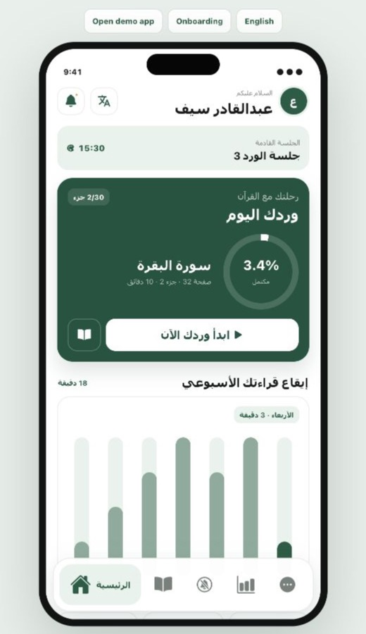
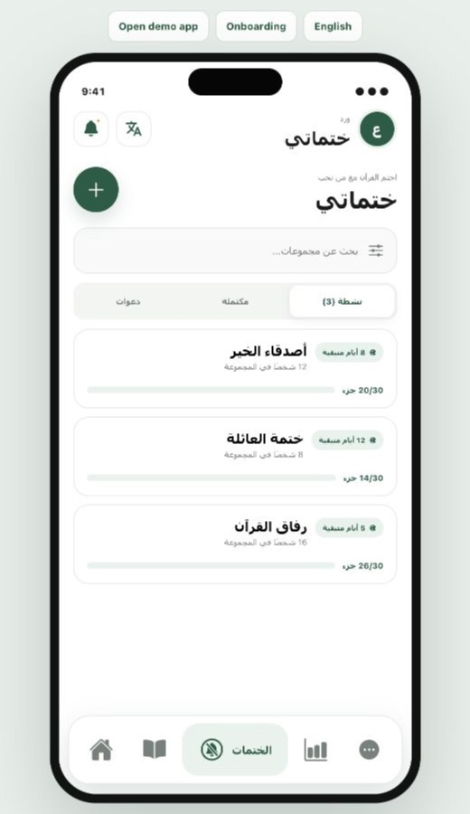
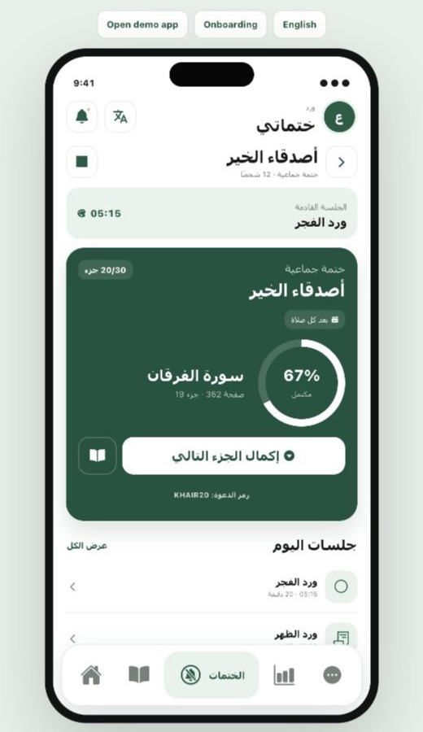
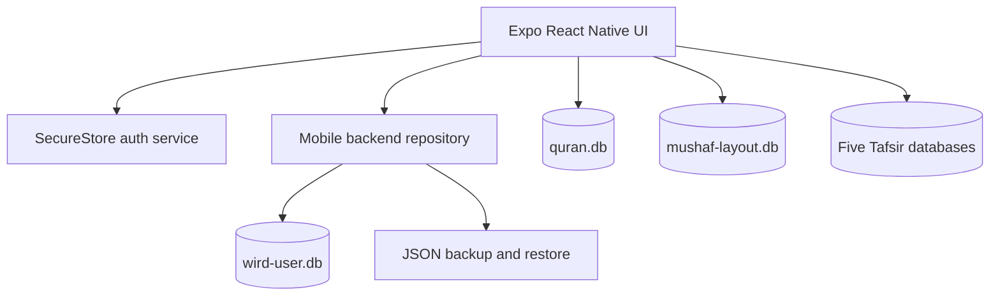

<p align="center">
  
</p>

<h1 align="center">Wirdy</h1>

<p align="center">
  A bilingual, local-first Quran reading companion for iOS and Android.
</p>

<p align="center">
  
  
  
  
  
</p>

<p align="center">
  <a href="PRIVACY_POLICY.md">Privacy Policy</a> ·
  <a href="TERMS_OF_USE.md">Terms of Use</a> ·
  <a href="THIRD_PARTY_NOTICES.md">Third-Party Notices</a>
</p>

## Overview

Wirdy adapts the complete Wird desktop reading workflow into an iOS-inspired
Expo application. It combines recurring reading sessions, a local Mushaf,
progress tracking, statistics, Tafsir sources, secure local authentication, and
portable backups in a single offline-capable project.

The repository contains both layers of the mobile product:

- **Frontend:** Expo, React Native, TypeScript, React Native SVG, and Ionicons.
- **Backend:** Expo SQLite repositories, SecureStore authentication, local
  backup/restore, and bundled read-only Quran data sources.

There is no required remote API. User data stays on the device unless the user
explicitly exports a backup.

## Open-Source Foundation

Wirdy is a mobile adaptation built from and inspired by the open-source
[Wird project by abu-ayesh](https://github.com/abu-ayesh/wird-project). The
upstream project is distributed under the MIT License, with copyright attributed
to Mohammad Zhour. Its copyright and permission notice are preserved in this
repository.

Wirdy's Expo interface, mobile SQLite repository, local authentication flow,
virtual iPhone simulator, and mobile interaction design adapt the upstream
desktop experience for iOS and Android. See
[LICENSE_SCOPE.md](LICENSE_SCOPE.md) for the boundary between project-owned
code and bundled third-party Quran resources.

## Screenshots

<table>
  <tr>
    <td align="center"><strong>Reading Dashboard</strong></td>
    <td align="center"><strong>Collaborative Khatamat</strong></td>
    <td align="center"><strong>Group Progress</strong></td>
  </tr>
  <tr>
    <td></td>
    <td></td>
    <td></td>
  </tr>
</table>

The product interface supports Arabic RTL and English LTR. These screens were
captured from the repository's interactive virtual iPhone simulator.

## Product Features

- Arabic RTL and English LTR interfaces with Latin numerals in both languages.
- iOS-inspired navigation, bottom sheets, segmented controls, switches, and
  accessible touch targets.
- Animated circular progress and interactive weekly reading charts.
- Home dashboard with greeting, avatar, notifications, next session, daily
  goal, reading streak, pages read, and Khatma progress.
- Quran reader with page navigation, bookmarks, Tafsir entry points, quick
  jump, free reading, and timed sessions.
- Session start, pause, early completion, completion, postponement, filtering,
  and history.
- Collaborative Khatamat with searchable groups, invite codes, members,
  automatic 30-Juz progress, group detail, and completion state.
- Recurring plan management for one to five daily sessions.
- Reading statistics derived from persisted session history.
- Local onboarding, account creation, sign-in, session restoration, and
  sign-out.
- JSON backup and restore using the native document picker and share sheet.
- Bilingual Privacy Policy and Terms of Use available from the More tab.
- Branded app icon, splash screen, web favicon, and browser-based iPhone
  simulator.

## Architecture



### User Database

`src/services/mobile-backend.ts` owns the local backend and preserves the
desktop-compatible data model:

| Table | Responsibility |
| --- | --- |
| `reading_plan` | Active plan, starting position, repeat mode, and schedule |
| `reading_times` | Recurring session names, times, durations, and enabled state |
| `reading_progress` | Current Surah, Ayah, Mushaf page, and global Ayah |
| `reading_sessions` | Scheduled and historical session lifecycle records |
| `khatma_groups` | Group identity, invite code, schedule, deadline, and status |
| `khatma_members` | Group membership and organizer roles |
| `khatma_parts` | Unique Juz contributions and per-member attribution |
| `settings` | Reader appearance, reminders, audio, and content preferences |
| `mobile_state` | Mobile-only serialized UI state |

SQLite foreign keys, WAL journaling, transactions, and indexes are initialized
when the application starts. Session statistics and Khatma progress are
calculated from persisted records rather than hard-coded UI values. A group is
marked complete automatically when all 30 unique Juz records exist.

Khatamat are fully functional as a local-first workflow and are included in
backup and restore. Cross-device, real-time group synchronization requires a
hosted API and authenticated sync service; this repository intentionally does
not claim remote collaboration that is not configured.

### Authentication

`src/services/auth-service.ts` stores the local account and active session in
the iOS Keychain or Android Keystore through Expo SecureStore. Passwords are
salted and hashed before storage. This is local application access, not a cloud
identity or multi-device synchronization service.

## Bundled Sources

The same read-only source set used by the desktop application is included under
`assets/` and packaged by Metro:

| Source | Purpose |
| --- | --- |
| `quran.db` | 6,236 Uthmani Quran Ayahs and Surah metadata |
| `mushaf-layout.db` | Mushaf page and glyph layout metadata |
| `ar-tafseer-al-qurtubi.db` | Tafsir al-Qurtubi |
| `ar-tafseer-al-saddi.db` | Tafsir al-Saadi |
| `ar-tafsir-al-tabari.db` | Tafsir al-Tabari |
| `ar-tafsir-ibn-kathir.db` | Tafsir Ibn Kathir |
| `ar-tafsir-muyassar.db` | Al-Tafsir al-Muyassar |

Run `npm run verify:sources` to validate the SHA-256 checksum of every bundled
database and the application icon. See [THIRD_PARTY_NOTICES.md](THIRD_PARTY_NOTICES.md)
before redistributing Quran, Mushaf, or Tafsir data.

## Getting Started

### Requirements

- Node.js 20 or newer
- npm 10 or newer
- Expo Go for device testing, or Xcode/Android Studio for native simulators

### Install

```bash
git clone https://github.com/omarignammas/Wirdy.git
cd Wirdy
npm ci
```

### Run

```bash
npm start
```

From the Expo terminal, scan the QR code with Expo Go or select a platform.
Platform-specific commands are also available:

```bash
npm run ios
npm run android
npm run web
```

## Browser iPhone Simulator

The simulator is a self-contained browser preview for reviewing screens and
interactions without Xcode or Android Studio. It includes onboarding, sign-up,
sign-in, all five main tabs, Khatma create/join/progress flows, plan editing,
bilingual layout, animated charts, and backup demonstrations.

```bash
python3 -m http.server 4173
```

Open:

```text
http://127.0.0.1:4173/preview/iphone-overview.html
```

The browser simulator is a product preview. Native persistence, SecureStore,
SQLite, document picking, sharing, and notification permissions run through the
Expo application.

## Scripts

| Command | Description |
| --- | --- |
| `npm start` | Start the Expo development server |
| `npm run ios` | Start Expo and request the iOS target |
| `npm run android` | Start Expo and request the Android target |
| `npm run web` | Start the Expo web target |
| `npm run typecheck` | Run strict TypeScript validation |
| `npm run verify:sources` | Verify bundled database and logo integrity |
| `npm run verify` | Run all repository verification checks |

## Project Structure

```text
Wirdy/
├── App.tsx                         # Application shell and product screens
├── app.json                        # Expo, icon, splash, and platform config
├── assets/
│   ├── databases/                  # Quran and Mushaf SQLite sources
│   ├── tafsir/                     # Five bundled Tafsir SQLite sources
│   └── wird-app-icon.png           # App icon, splash, and favicon
├── preview/iphone-overview.html    # Interactive browser iPhone simulator
├── PRIVACY_POLICY.md               # English and Arabic privacy disclosures
├── scripts/verify-data-sources.mjs # SHA-256 source integrity verification
├── TERMS_OF_USE.md                 # English and Arabic app terms
└── src/
    ├── AuthFlow.tsx                # Onboarding, sign-up, and sign-in
    ├── legal-content.ts             # In-app bilingual legal content
    ├── locales.ts                  # Arabic and English product copy
    └── services/
        ├── auth-service.ts         # SecureStore account/session repository
        └── mobile-backend.ts       # SQLite schema, queries, actions, backups
```

## Privacy and Platform Notes

- Reading history, plans, settings, and progress are stored locally.
- Backups are user-initiated JSON files and are not uploaded by the app.
- The current build contains no advertising, analytics, tracking SDK, remote
  account, or cloud synchronization service.
- Review the [Privacy Policy](PRIVACY_POLICY.md) and
  [Terms of Use](TERMS_OF_USE.md) before distributing the app.
- Notification delivery and background behavior should be validated on a
  physical iOS and Android device before a production release.
- Configure production bundle identifiers, signing, notification permission
  copy, and store metadata before App Store or Play Store submission.

## Verification

The repository is continuously checked with GitHub Actions using Node.js 20.
CI performs a clean install, strict TypeScript validation, and bundled-source
integrity verification.

## License

Project-owned source code and documentation are provided under the
[MIT License](LICENSE). Wirdy preserves attribution to the upstream
[abu-ayesh/wird-project](https://github.com/abu-ayesh/wird-project). Quran text,
Mushaf layout data, Tafsir databases, and other third-party resources remain
subject to their original terms. Review
[LICENSE_SCOPE.md](LICENSE_SCOPE.md) and
[THIRD_PARTY_NOTICES.md](THIRD_PARTY_NOTICES.md) for details.
